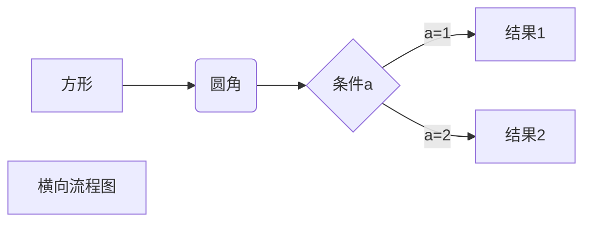
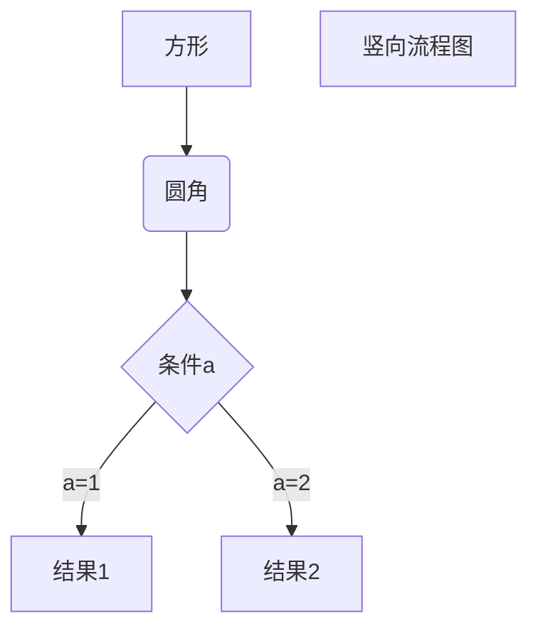
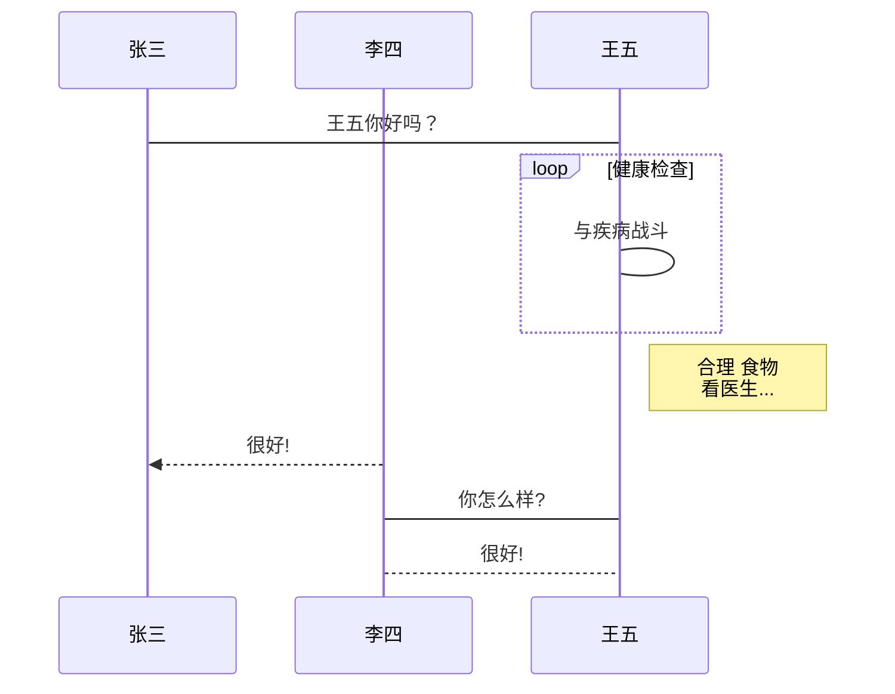
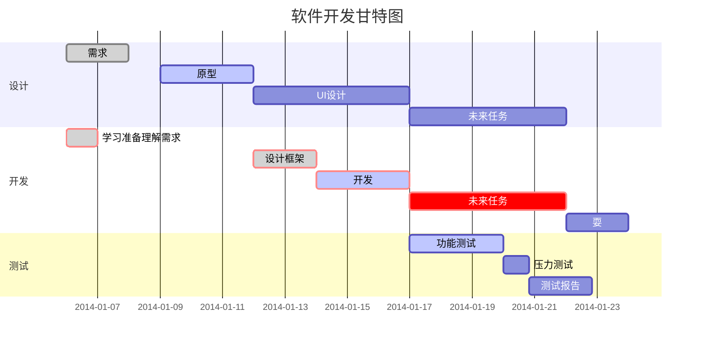

# 基础语法
## 字体
### 标题
- 使用底线的语法
```
我是一级标题
=========
```
  或
```
我是二级标题
---------
```
> 注：这种语法只支持两级标题

- 使用#的语法（推荐）
```
# 我是一级标题
## 我是二级标题
### 我是三级标题
#### 我是四级标题  
##### 我是五级标题
###### 我是六级标题
```
> 注：这种语法只支持六级标题

### 粗体和斜体
- 粗体格式的语法如下
```
**加粗内容**（推荐）
```
或
```
__加粗内容__
```
- 斜体格式的语法如下
```
*斜体内容*（推荐）
```
或
```
_斜体内容_
```
## 段落与换行
```
片段1[空格][空格][回车]
片段2
```
片段1  
片段2

## 分割线
```
星号
***
* * *
*********
减号
---
- - -
---------
下划线
___
_ _ _
_________
```
星号

***
* * *
*********

横杠

---
- - -
---------

下划线

___
_ _ _
_________

## 删除线
```
~~被删除的文字~~
```
~~被删除的文字~~

## 下划线
```
<u>下划线文字</u>
```
<u>下划线文字</u>

## 转义
- 语法如下
```
\特殊符号
```
- 特殊符号如下
```
\   反斜线
`   反引号
*   星号
_   下划线
{}  花括号
[]  方括号
()  小括号
#   井字号
+   加号
-   减号
.   英文句点
!   感叹号
```
- Example:
```
\*\* 正常显示星号 \*\* 
```
\*\* 正常显示星号 \*\* 

## 表情符号
```
:smile:
:laughing:
:+1:
:-1:
:clap:
```
:smile:
:laughing:
:+1:
:-1:
:clap:

其他表情符号参考[Markdown Emoji表情语法速查表](https://sunhwee.com/posts/a927e90e.html)

## 列表
### 无序列表
```
* 第一项
* 第二项
* 第三项

+ 第一项
+ 第二项
+ 第三项

- 第一项
- 第二项
- 第三项
```
* 第一项
* 第二项
* 第三项

+ 第一项
+ 第二项
+ 第三项

- 第一项
- 第二项
- 第三项

### 有序列表
```
1. 第一项
2. 第二项
3. 第三项
```
1. 第一项
2. 第二项
3. 第三项

### 嵌套列表
```
- 第一项
    1. 第一子项
    2. 第二子项
    3. 第三子项
- 第二项
- 第三项
```
- 第一项
    1. 第一子项
    2. 第二子项
    3. 第三子项
- 第二项
- 第三项

```
1. 第一项
    - 第一子项
    - 第二子项
    - 第三子项
2. 第二项
3. 第三项
```
1. 第一项
    - 第一子项
    - 第二子项
    - 第三子项
2. 第二项
3. 第三项

## 脚注
```
我儿时的偶像是[^阿伦艾弗森]
[^阿伦艾弗森]: 艾伦·艾泽尔·艾弗森（英语：Allen Ezail Iverson，1975年6月7日－），绰号“答案”（The Answer），中文圈另有“战神”之美称，美国职业篮球运动员及饶舌歌手。场上位置为得分后卫和控球后卫。在全美篮球协会（NBA）打了14个赛季。生涯十一次入选NBA全明星赛并夺得两次全明星赛最有价值球员，三次入选NBA年度第一队，3次入选NBA年度第二队，2006年入选NBA年度第三队。在2000–01赛季，艾弗森打出了生涯最好表现，当选该赛季的NBA最有价值球员，并帮助费城七六人打进NBA总决赛，可惜未能夺冠。
```
我儿时的偶像是[^阿伦艾弗森]
[^阿伦艾弗森]: 艾伦·艾泽尔·艾弗森（英语：Allen Ezail Iverson，1975年6月7日－），绰号“答案”（The Answer），中文圈另有“战神”之美称，美国职业篮球运动员及饶舌歌手。场上位置为得分后卫和控球后卫。在全美篮球协会（NBA）打了14个赛季。生涯十一次入选NBA全明星赛并夺得两次全明星赛最有价值球员，三次入选NBA年度第一队，3次入选NBA年度第二队，2006年入选NBA年度第三队。在2000–01赛季，艾弗森打出了生涯最好表现，当选该赛季的NBA最有价值球员，并帮助费城七六人打进NBA总决赛，可惜未能夺冠。

## 链接
### 文字链接
```
在日常工作中我们经常使用的网址有[Google](https://www.google.com/)、[Github](https://github.com/)和[Stack Overflow]（https://stackoverflow.com/）
```
在日常工作中我们经常使用的网址有[Google](https://www.google.com/)、[Github](https://github.com/)和[Stack Overflow](https://stackoverflow.com/)

### 引用链接
```
在正文中引用链接标记，可以理解为引用定义好的变量:
[链接文字][链接标记]
在底部定义链接标记，可以理解为定义一个地址变量，建议放到页尾:
[链接标记]: https://pursue.show/
```
在正文中引用链接标记，可以理解为引用定义好的变量:
[链接文字][链接标记]
在底部定义链接标记，可以理解为定义一个地址变量，建议放到页尾:

[链接标记]: https://pursue.show/

### 网址链接
```
博客地址<https://pursue.show/>
```
博客地址<https://pursue.show/>
> 注: 扩展语法GFM中<>可省略

## 图片
### 图片链接
```
  
```
  

### 引用链接
```
![个人头像][pic]  
[pic]: https://qcdn-z1.qiniu.pursue.show/540%E9%98%BF%E6%96%B9.png
```
![个人头像][pic]  
[pic]: https://qcdn-z1.qiniu.pursue.show/540%E9%98%BF%E6%96%B9.png

### 图片标签
```
  
```
  

## 支持的HTML元素
```
使用 <kbd>Ctrl</kbd>+<kbd>Alt</kbd>+<kbd>Del</kbd> 重启电脑 
```
使用 <kbd>Ctrl</kbd>+<kbd>Alt</kbd>+<kbd>Del</kbd> 重启电脑 

## 引用与区块
### 引用
```
> 这是一个引用
```
> 这是一个引用

### 区块
- 区块嵌套
```
> 第一层
>> 第二层
>>> 第三层
>>>> 第四层
```
> 第一层
> > 第二层
> > > 第三层
> > >
> > > > 第四层

- 区块中使用列表
```
> 1. 第一项
> 2. 第二项
> - 第一项
> - 第二项
> - 第三项
```
> 1. 第一项
> 2. 第二项
> - 第一项
> - 第二项
> - 第三项

- 列表中使用区块
```
1. 第一项
    > 菜鸟教程
    > > 学的不仅是技术
    > >
    > > > 更是梦想
2. 第二项
```
1. 第一项
    > 菜鸟教程
    > > 学的不仅是技术
    > >
    > > > 更是梦想
2. 第二项

## 表格
### 表格格式
```
| 序号 | 标题 | 网址 |
| ------ | ------ | ------ |
| 01 | 博客 | https://pursue.show/ |
| 02 | 微博 | https://weibo.com/u/2270909331 |
```
| 序号 | 标题 | 网址 |
| ------ | ------ | ------ |
| 01 | 博客 | https://pursue.show/ |
| 02 | 微博 | https://weibo.com/u/2270909331 |

###  对齐格式
```
| 左对齐 | 居中对齐 | 右对齐 |
| :----- | :----: | -----: |
| 01 | 博客 | https://pursue.show/ |
| 02 | 微博 | https://weibo.com/u/2270909331 |
```
| 左对齐 | 居中对齐 | 右对齐 |
| :----- | :----: | -----: |
| 01 | 博客 | https://pursue.show/ |
| 02 | 微博 | https://weibo.com/u/2270909331 |

### 表格内使用其他标记
```
| 序号 | 标题 | 网址 |
| ------ | ------ | ------ |
| *01* | [博客](https://pursue.show/) | https://pursue.show/ |
| **02** | [微博](https://weibo.com/u/2270909331) | https://weibo.com/u/2270909331 |
```
| 序号 | 标题 | 网址 |
| ------ | ------ | ------ |
| *01* | [博客](https://pursue.show/) | https://pursue.show/ |
| **02** | [微博](https://weibo.com/u/2270909331) | https://weibo.com/u/2270909331 |

## 任务列表
```
- [] 未勾选
- [x] 已勾选
```
- [ ] 未勾选
- [x] 已勾选
> 注：未勾选括号内要有空格

## 代码
### 行内代码
```
`Hello, world!`
```
`Hello, world!`

### 代码块
- Tab或4个空格开头的代码块
```
[Tab]int main(int argc, char * argv[]) {
				printf("Hello, World!");
				return 0;
		};
```

- 符号包裹的代码块（推荐）
~~~
```
int main(int argc, char * argv[]) {
	printf("Hello, World!");
	return 0;
};
```
~~~
或
```
~~~
int main(int argc, char * argv[]) {
	printf("Hello, World!");
	return 0;
};
~~~
```

- 语法高亮（C语言为例）
~~~
``` C
int main(int argc, char * argv[]) {
	printf("Hello, World!");
	return 0;
};
```
~~~

- 实际效果
``` C
int main(int argc, char * argv[]) {
	printf("Hello, World!");
	return 0;
};
```

## 公式
当你需要在编辑器中插入数学公式时，可以使用两个美元符 $$ 包裹 TeX 或 LaTeX 格式的数学公式来实现。提交后，问答和文章页会根据需要加载 Mathjax 对数学公式进行渲染。如：
```
$$
\mathbf{V}_1 \times \mathbf{V}_2 =  \begin{vmatrix} 
\mathbf{i} & \mathbf{j} & \mathbf{k} \\
\frac{\partial X}{\partial u} &  \frac{\partial Y}{\partial u} & 0 \\
\frac{\partial X}{\partial v} &  \frac{\partial Y}{\partial v} & 0 \\
\end{vmatrix}
${$tep1}{\style{visibility:hidden}{(x+1)(x+1)}}
$$
```
$$
\mathbf{V}_1 \times \mathbf{V}_2 =  \begin{vmatrix} 
\mathbf{i} & \mathbf{j} & \mathbf{k} \\
\frac{\partial X}{\partial u} &  \frac{\partial Y}{\partial u} & 0 \\
\frac{\partial X}{\partial v} &  \frac{\partial Y}{\partial v} & 0 \\
\end{vmatrix}
${$tep1}{\style{visibility:hidden}{(x+1)(x+1)}}
$$

## 流程图
- 横向流程图源码格式
~~~

~~~


- 竖向流程图源码格式
~~~

~~~


- 标准流程图源码格式
~~~
```flow
st=>start: 开始框
op=>operation: 处理框
cond=>condition: 判断框(是或否?)
sub1=>subroutine: 子流程
io=>inputoutput: 输入输出框
e=>end: 结束框
st->op->cond
cond(yes)->io->e
cond(no)->sub1(right)->op
```
~~~
```flow
st=>start: 开始框
op=>operation: 处理框
cond=>condition: 判断框(是或否?)
sub1=>subroutine: 子流程
io=>inputoutput: 输入输出框
e=>end: 结束框
st->op->cond
cond(yes)->io->e
cond(no)->sub1(right)->op
```

- 标准流程图源码格式（横向）
~~~
```flow
st=>start: 开始框
op=>operation: 处理框
cond=>condition: 判断框(是或否?)
sub1=>subroutine: 子流程
io=>inputoutput: 输入输出框
e=>end: 结束框
st(right)->op(right)->cond
cond(yes)->io(bottom)->e
cond(no)->sub1(right)->op
```
~~~
```flow
st=>start: 开始框
op=>operation: 处理框
cond=>condition: 判断框(是或否?)
sub1=>subroutine: 子流程
io=>inputoutput: 输入输出框
e=>end: 结束框
st(right)->op(right)->cond
cond(yes)->io(bottom)->e
cond(no)->sub1(right)->op
```

- UML时序图源码样例
~~~
```sequence
对象A->对象B: 对象B你好吗?（请求）
Note right of 对象B: 对象B的描述
Note left of 对象A: 对象A的描述(提示)
对象B-->对象A: 我很好(响应)
对象A->对象B: 你真的好吗？
```
~~~
```sequence
对象A->对象B: 对象B你好吗?（请求）
Note right of 对象B: 对象B的描述
Note left of 对象A: 对象A的描述(提示)
对象B-->对象A: 我很好(响应)
对象A->对象B: 你真的好吗？
```

- UML时序图源码复杂样例
~~~
```sequence
Title: 标题：复杂使用
对象A->对象B: 对象B你好吗?（请求）
Note right of 对象B: 对象B的描述
Note left of 对象A: 对象A的描述(提示)
对象B-->对象A: 我很好(响应)
对象B->小三: 你好吗
小三-->>对象A: 对象B找我了
对象A->对象B: 你真的好吗？
Note over 小三,对象B: 我们是朋友
participant C
Note right of C: 没人陪我玩
```
~~~
```sequence
Title: 标题：复杂使用
对象A->对象B: 对象B你好吗?（请求）
Note right of 对象B: 对象B的描述
Note left of 对象A: 对象A的描述(提示)
对象B-->对象A: 我很好(响应)
对象B->小三: 你好吗
小三-->>对象A: 对象B找我了
对象A->对象B: 你真的好吗？
Note over 小三,对象B: 我们是朋友
participant C
Note right of C: 没人陪我玩
```

- UML标准时序图样例
~~~

~~~


- 甘特图样例
~~~

~~~


